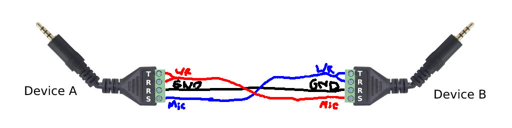

# MiniTTY

A little full-duplex soundcard "modem" emulator that relies on [`minimodem`](https://github.com/kamalmostafa/minimodem).

* [Requirements](#requirements)
* [Installation](#installation)
* [Usage](#usage)
* [How it Works](#how-it-works)
* [Tips](#tips)
* [Troubleshooting](#troubleshooting)

---

### Requirements

* A relatively modern linux distro with `bash` or `ksh` installed.
* Read/write access to `/tmp`.
* A soundcard with *both* audio output and input support.
* An installation of [`minimodem`](https://github.com/kamalmostafa/minimodem).

---

### Installation

1. Clone this repo or download it as a `zip` archive.
2. Navigate to your downloaded copy.
3. Make `minitty` executable with `chmod +x minitty`.
4. Copy `minitty` to wherever you want.

---

### Usage

**`./minitty [options]`**

*By default*, MiniTTY behaves like an American TTY/TDD.

The syntax for `[options]` is *almost* identical to that of [`minimodem`](https://github.com/kamalmostafa/minimodem)'s, with a few exceptions:
1. Do not use `--tx` or `--rx` as MiniTTY uses them on its own to set up the TX and RX processes.
2. Do not use `--quiet` as it is used by default on the RX process.

Assume outputs like `[SYS] ...` or `=====` are being produced by MiniTTY itself and not your remote system.

---

### How it Works

MiniTTY is essentially a wrapper that launches two [`minimodem`](https://github.com/kamalmostafa/minimodem) instances (one for TX, one for RX) and slams the TX's input and RX's output together in one console.

*On startup*, MiniTTY...
1. Gets user-selected options for both [`minimodem`](https://github.com/kamalmostafa/minimodem) instances (or default to `tdd` if nothing is supplied).
2. Opens/creates a pipe for data being sent to the TX process: `/tmp/minitty_tx_[id]`.
3. Launches the TX process, pipes its input in from the TX pipe, and saves its PID.
4. Opens/creates a pipe for data being recieved from the RX process: `/tmp/minitty_rx_[id]`.
5. Launches the RX process, pipes its output out to the RX pipe, and saves its PID.
6. Connects the console's input and output to the RX and TX pipes, respectively.

MiniTTY then *waits* for the user to strike *`CTRL+C`*.

*On shutdown*, MiniTTY...
1. Closes the console's connections to both pipes.
2. Kills the RX process using the PID from earlier.
3. Closes/deletes the pipe used for recieving RX data.
4. Kills the TX process using the PID from earlier.
5. Closes/deletes the pipe used for sending TX data.

It's an incredibly basic concept that seems to work well enough for my purposes, hence why MiniTTY is contained entirely within a single shell script.

---

### Tips

Most modern devices no longer come equipped with separate speaker and microphone jacks like they used to, unfortunately. Nowadays, devices have combined these two inputs/outpus into a single plug, usually in the form of a TRRS (Tip Ring Ring Sleeve) jack. This makes connecting your computer to a phone or another computer with the output of one going into another and vice versa somewhat difficult.

While it is possible to position your phone or other computer in just the right way on/near your machine's microphone and speakers, there is a better way of "coupling" them together... a TRRS "crossover" cable. As long as you can find the right pinouts for both devices, you can "cross over" the speaker output of one into the microphone input of the other by just connecting them like that.

An example diagram has been provided below (please note the pinout of your device may be different):

---

### Troubleshooting

Things might go wrong, here's some tips on common issues.

> I'm not recieving anything from my remote system!

Have you checked your input connections and microphone settings?

> My remote system isn't getting anything I transmit to it!

Have you checked your output connections and speaker settings?

> Everything is garbled going both ways!

Check the baud rate and encoding/parity settings you're passing to [`minimodem`](https://github.com/kamalmostafa/minimodem).

> I'm seeing an echo of my TX in my RX!

Some linux distributions don't play nice with the piping methods I've used, and some computers do strange things with audio inputs/outpus. Consider this "bug" a "feature" for now.
